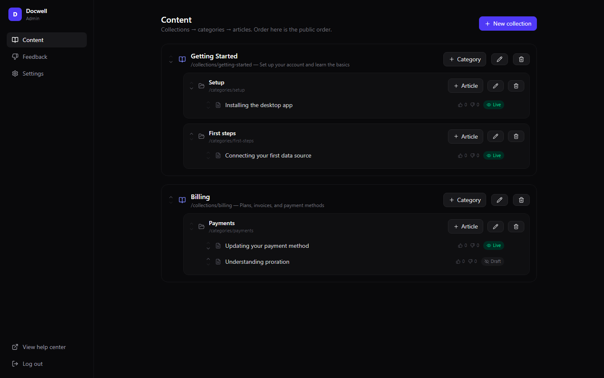

# 📚 Docwell — Self-Hosted Knowledge Base & Help Center

[](LICENSE)

**Pay once. Own it forever. No subscription.**

Docwell is a complete, self-hosted help center — the kind you'd pay HelpScout Docs, GitBook, or Intercom Articles **$29–$99/month** for, running on your own hardware or a $5 VPS. Write articles in markdown with a live split-pane preview, organize them into collections and categories, and give your customers a fast, branded, SEO-ready help center with instant full-text search.



## ✨ Features

**Public help center**
- 🎨 Branded home page — your logo, brand color, hero search box
- ⚡ Instant search-as-you-type powered by SQLite FTS5, with highlighted snippets
- 📑 Article pages with auto-generated table of contents, prev/next navigation, and related articles
- 👍 "Was this helpful?" votes with optional comment on 👎 — one vote per visitor
- 🔍 SEO done right: meta descriptions, OG tags, `sitemap.xml`, `robots.txt`, canonical URLs, clean URLs
- 🧭 Smart 404 pages that suggest the closest matching articles

**Admin dashboard**
- ✍️ Markdown editor with **split-pane live preview** (rendered by the exact same pipeline as the public site)
- 🖼️ Image upload — click a button or just paste an image into the editor
- 🔗 Internal `[[article-slug]]` links + hand-picked related articles
- 🗂️ Collections → categories → articles with drag-free reordering and slug control
- 📝 Draft / published workflow — drafts are invisible to visitors and excluded from search
- 📉 Feedback report: worst-scoring articles first, with every 👎 comment, so you know exactly what to fix

**Ops**
- 🗄️ Single SQLite file — trivial backups, no database server
- 🐳 Dockerfile + docker-compose included
- 🖥️ **Desktop mode** — run the whole thing as a Windows app, no server needed
- 🔒 100% local, zero telemetry, no external services

## 🚀 Quick start

```bash
npm i
npm run build   # build the admin UI
npm start       # → http://localhost:5313  (admin at /admin, password "admin")
```

Set a real password before deploying: copy `.env.example` to `.env` style env vars (`ADMIN_PASSWORD=...`).

**Run it as a desktop app, or deploy to a $5 VPS when you need it public.**

```bash
npm run desktop        # Electron app, data stored in your user profile, auto-logged-in
```

**Docker (VPS):**

```bash
ADMIN_PASSWORD=your-secret docker compose up -d
```

## 🖥️ Two modes, one codebase

| Mode | How | Data lives in |
|---|---|---|
| Desktop app | `npm run desktop` (or the NSIS installer via `npm run dist`) | Electron `userData` dir |
| VPS / self-hosted web | `npm run build && npm start` or Docker | `./data` (or `DATA_DIR`) |

The Electron wrapper boots the identical Express server on a free local port and opens a window already logged in as admin — nothing forked, nothing duplicated.

## 💰 vs. the subscription tools

| | **Docwell** | HelpScout Docs | GitBook | Intercom Articles |
|---|---|---|---|---|
| Price | **$29 once** | from $22/user/mo (in Plus) | from $79/site/mo (Premium) | from $39/mo + add-ons |
| Your data | Your server, one SQLite file | Their cloud | Their cloud | Their cloud |
| Custom branding | ✅ Free | Higher tiers | Higher tiers | Higher tiers |
| Full-text search | ✅ FTS5, instant | ✅ | ✅ | ✅ |
| Helpful-vote analytics | ✅ | ✅ | Limited | ✅ |
| Remove "Powered by" | ✅ It's your code | ❌/paid | Paid | Paid |
| Works offline / air-gapped | ✅ | ❌ | ❌ | ❌ |
| Price after 3 years | **Still $29** | $792+ | $2,844+ | $1,404+ |

## ☕ Skip the setup — get the 1-click installer

Don't want to touch a terminal? Grab the packaged Windows installer (plus lifetime updates) on Whop:

**→ [https://whop.com/onetime-suite](https://whop.com/onetime-suite)**

## 🛠️ Tech stack

- **Server:** Node 20+, Express, better-sqlite3 (WAL + FTS5), marked
- **Public site:** server-rendered HTML (zero JS framework → fast + SEO-perfect), vanilla-JS instant search
- **Admin:** React 18, Vite, Tailwind CSS 4, Framer Motion, Lucide icons
- **Desktop:** Electron wrapper around the same server, electron-builder NSIS config

## 🧪 Tests

```bash
npm test
```

Boots a real server on a temp database and verifies: auth, content CRUD, markdown → HTML with TOC anchors and code blocks, FTS search snippets, draft privacy, one-vote-per-visitor feedback, sitemap.xml, image upload round-trip, 404 suggestions, and internal/related links.

## 📄 License

MIT © 2026 Ben ([bensblueprints](https://github.com/bensblueprints))
